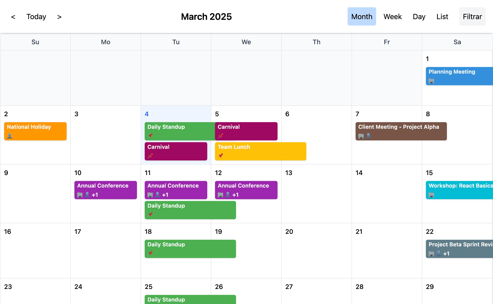
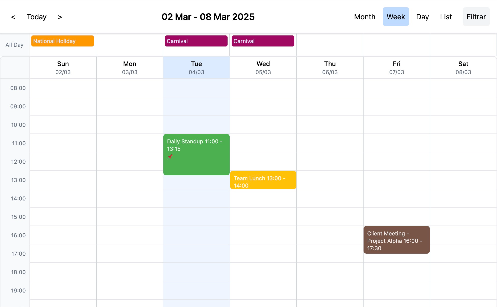
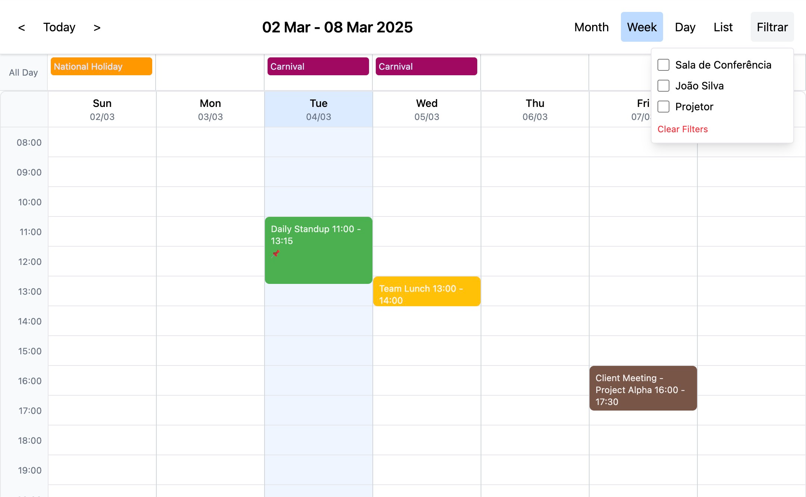
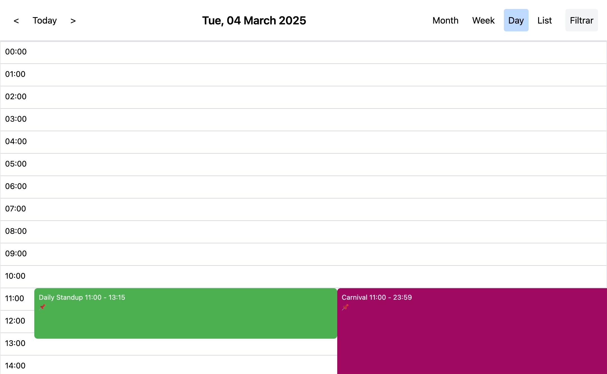
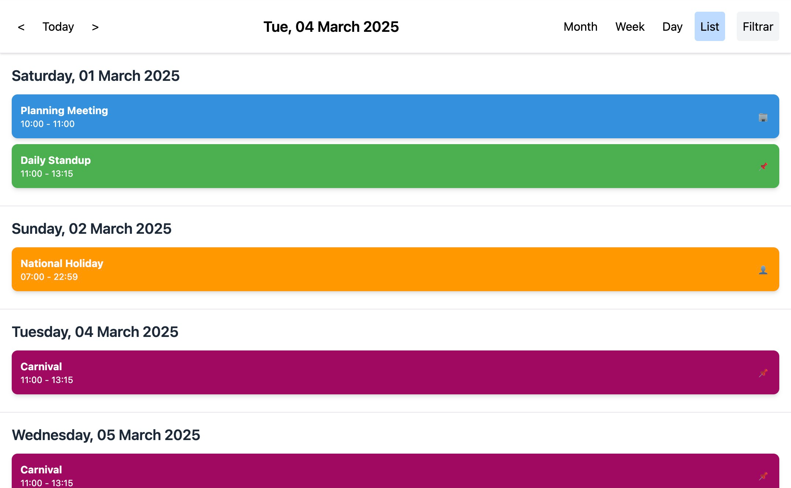

# React Agendfy Calendar Component

[](https://www.npmjs.com/package/react-agendfy)


**React Agendfy** is a flexible and customizable calendar component for React applications. It supports various calendar views, drag and drop event management, recurring events, resource filtering, and now with enhanced timezone support and notification functionalities.

## Table of Contents

1.  [Features](#features)
2.  [Installation](#installation)
3.  [Usage](#usage)
    * [Basic Usage](#basic-usage)
    * [Calendar Views](#calendar-views)
    * [Event Handling](#event-handling)
    * [Drag and Drop](#drag-and-drop)
    * [Recurring Events](#recurring-events)
    * [Resource Filtering](#resource-filtering)
    * [Time Zones](#time-zones)
    * [Notifications (Alerts)](#notifications-alerts)
4.  [Configuration Options (Config Prop)](#configuration-options-config-prop)
5.  [Events Object Structure](#events-object-structure)
6.  [Resources Object Structure](#resources-object-structure)
7.  [Email Adapter](#email-adapter)
8.  [Localization (i18n)](#localization-i18n)
9.  [Contributing](#contributing)
10. [License](#license)

## Features

  - **Multiple Calendar Views**: Supports month, week, day, and list views.
  - **Drag & Drop Event Management**: Easily move and resize events within the calendar.
  - **Recurring Events**: Handles events that repeat daily, weekly, monthly, etc., using RRule.
  - **Event Resizing**:  Adjust event durations directly on the calendar (week and day views).
  - **Resource Filtering**: Filter events by assigned resources.
  - **Timezone Support**:  Comprehensive timezone handling using `@date-fns/tz`.
  - **Event Notifications (Alerts)**: Configure alerts to remind users of upcoming events.
  - **Customizable Configuration**:  Extensive `config` prop to tailor the calendar's appearance and behavior.
  - **Localization**: Basic localization for text elements.
  - **Resource Display**:  Visually represent event resources.
  - **Tooltips**:  Informative tooltips for events.
  - **Business Hours**:  Highlight business hours in the calendar view.
  - **Event Click and Slot Click Handlers**:  Callbacks for user interactions.

## Installation

```bash
npm install react-agendfy date-fns date-fns-tz rrule @dnd-kit/core @dnd-kit/modifiers @dnd-kit/utilities re-resizable
```

or

```bash
yarn add react-agendfy date-fns date-fns-tz rrule @dnd-kit/core @dnd-kit/modifiers @dnd-kit/utilities re-resizable
```

Ensure you have installed all peer dependencies listed in the `peerDependencies` section of the `package.json`.

## Usage

### Basic Usage

Import the `Calendar` component and necessary dependencies into your React component:

```jsx
import React, { useState, useCallback, useMemo, useRef, useEffect } from 'react';
import Calendar from 'react-agendfy';
import { format } from 'date-fns';

const initialEvents = [
    {
        id: "1",
        "title": "Sample Event",
        "start": "2025-07-20T10:00:00.000Z",
        "end": "2025-07-20T12:00:00.000Z",
        "color": "#3490dc",
        "isAllDay": false,
        "isMultiDay": false,
    }
];

function MyCalendarApp() {
    const [events, setEvents] = useState(initialEvents);
    const calendarRef = useRef(null);


    const defaultConfig = {
        timezone: 'UTC', // or 'America/Sao_Paulo', 'Africa/Luanda', etc.
        defaultView: "week",
        slotDuration: 30,
        slotLabelFormat: "HH:mm",
        slotMin: "00:00",
        slotMax: "23:59",
        lang: 'en',
        today: 'Today',
        monthView: 'Month',
        weekView: 'Week',
        dayView: 'Day',
        listView: 'List',
        all_day: 'All Day',
        clier_filter: 'Clear Filters',
        filter_resources: 'Filter Resources',

    };

    const config = useMemo(() => {
        return defaultConfig;
    }, []);


    const handleEventUpdate = useCallback((updatedEvent) => {
        console.log("Updated event:", updatedEvent);
        // Implement your event update logic here, e.g., API calls, state updates
        setEvents(events.map(event => event.id === updatedEvent.id ? updatedEvent : event));
    }, [events, setEvents]);


    const handleEventClick = useCallback((event) => {
        console.log("Clicked event:", event);
        alert(`Clicked event: ${event.title}`);
    }, []);

    const handleDayClick = useCallback((dayDate) => {
        console.log("Clicked day:", dayDate);
        alert(`Clicked day: ${format(dayDate, 'dd/MM/yyyy')}`);
    }, []);

    const handleSlotClick = useCallback((slotTime) => {
        console.log("Clicked slot:", slotTime);
        alert(`Clicked slot: ${format(slotTime, 'HH:mm dd/MM/yyyy')}. You can add a new event here.`);
    }, []);


    return (
        <div style={{ height: '800px', width: '100%' }}>
            <Calendar
                events={events}
                config={config}
                onEventUpdate={handleEventUpdate}
                onEventClick={handleEventClick}
                onDayClick={handleDayClick}
                onSlotClick={handleSlotClick}
            />
        </div>
    );
}

export default MyCalendarApp;
```

### Calendar Views

React Agendfy supports four main calendar views, configurable via the `defaultView` option in the `config` prop:

  - **Month View**: Displays a traditional month grid. Set `defaultView: "month"`.
  - **Week View**: Shows a weekly agenda with time slots. Set `defaultView: "week"`.
  - **Day View**: Focuses on a single day's schedule with time slots. Set `defaultView: "day"`.
  - **List View**: Presents events in a list format, grouped by day for the current month. Set `defaultView: "list"`.

Users can navigate between views using the view selector in the calendar header.

### Event Handling

  - **`onEventClick(event: Event)`**: Callback function triggered when an event is clicked. Provides the event object as a parameter.
  - **`onEventUpdate(updatedEvent: Event)`**: Callback function for when an event is dragged and dropped to a new time slot or resized. It is crucial to update your event state with the `updatedEvent` provided.
  - **`onEventResize(resizedEvent: Event)`**: Callback function when an event is resized (Week and Day views only). Update your event state with the `resizedEvent`.

### Drag and Drop

  - **Enable Drag and Drop**: Drag and drop functionality is enabled by default when you provide the `onEventUpdate` and `onEventResize` callbacks.
  - **Moving Events**: Drag events to different time slots in week and day views to reschedule them. The `onEventUpdate` callback is triggered after a successful drag and drop operation.
  - **Resizing Events**: Resize events vertically in week and day views by dragging the bottom border of the event. The `onEventResize` callback is triggered upon resizing completion.

### Recurring Events

React Agendfy supports recurring events using the [RRule](https://www.google.com/url?sa=E&source=gmail&q=https://github.com/jakubroztocil/rrule) standard. Define recurrence rules in your event objects using the `recurrence` property.

```javascript
{
    id: "4",
    title: "Daily Standup",
    start: "2025-03-01T10:00:00.000Z",
    end: "2025-03-01T12:15:00.000Z",
    color: "#4caf50",
    recurrence: "FREQ=WEEKLY;INTERVAL=1;COUNT=10", // Example: Weekly for 10 occurrences
    isAllDay: false,
    isMultiDay: false,
},
```

The `expandRecurringEvents` utility function (exported from the library) can be used to expand recurring events into individual event instances for a given date range.

### Resource Filtering

  - **Resource Definition**: Define resources as an array of objects with `id`, `name`, and `type` properties. Pass this array to the `resources` prop of the `Calendar` component.
  - **Event Resources**: Assign resources to events using the `resources` property of the event object.
  - **Filtering Interface**: The calendar provides a built-in UI to filter events by resource type.
  - **`onResourceFilterChange(selectedResources: string[])`**:  Callback function that is called when the resource filter changes, providing an array of selected resource IDs.
  - **`filteredResources: string[]`**: Prop to control the resource filter externally. Pass an array of resource IDs to filter events displayed on the calendar.

### Time Zones

React Agendfy is timezone-aware, leveraging the `@date-fns/tz` library.

  - **Configuration**: Set the `timezone` property in the `config` prop to your desired timezone (e.g., `'America/Sao_Paulo'`, `'UTC'`, `'Africa/Luanda'`). Default timezone is **'UTC'**.

  - **TZDate**: Internally, the component uses `TZDate` objects from `@date-fns/tz` to handle dates and times, ensuring all calculations and displays are timezone-consistent.

  - **Event Dates**: Event `start` and `end` properties should be provided in ISO 8601 format (e.g., `"2025-07-20T10:00:00.000Z"`). While the component processes dates internally as `TZDate` objects with the configured timezone, it's recommended to store and manage event dates in UTC or a consistent timezone format to avoid ambiguity.

  - **Example Config**:

    ```javascript
    const config = useMemo(() => ({
        timezone: 'Africa/Luanda', // Example: Set timezone to Luanda
        // ... other configurations
    }), []);
    ```

    By configuring the `timezone`, the calendar will display times and perform date calculations according to the specified timezone, ensuring accurate representation for users in different time zones.

### Notifications (Alerts)

React Agendfy allows you to configure notifications or alerts for events using the `alertBefore` property in the event object. To enable email notifications, you need to implement and provide an `EmailAdapter` to the `Calendar` component.

  - **`alertBefore` Property**: In your event object, add `alertBefore` property to specify a reminder in minutes before the event starts.

    ```javascript
    {
        id: "6",
        title: "Team Lunch",
        start: "2025-03-05T14:00:00.000Z",
        end: "2025-03-05T15:00:00.000Z",
        color: "#ffc107",
        isAllDay": false,
        isMultiDay": false,
        alertBefore: 15, // Alert 15 minutes before event start
    }
    ```

  - **`EmailAdapter` Interface**: Define an adapter object that conforms to the `EmailAdapter` interface:

    ```typescript
    interface EmailAdapter {
        sendEmail: (subject: string, body: string, recipient: string) => Promise<void>;
    }
    ```

  - **Implementing `EmailAdapter`**: Create an object that implements the `EmailAdapter` interface with your email sending logic. Example using `console.log` for demonstration:

    ```javascript
    const myEmailAdapter = {
        sendEmail: async (subject, body, recipient) => {
            console.log("Sending email:", { subject, body, recipient });
            // Implement your actual email sending logic here (e.g., using an API, SMTP, etc.)
            return Promise.resolve();
        },
    };
    ```

  - **`emailAdapter` Prop**: Pass your implemented `EmailAdapter` to the `Calendar` component via the `emailAdapter` prop:

    ```jsx
    <Calendar
        // ...other props
        emailAdapter={myEmailAdapter}
    />
    ```

  - **`emailConfig` Prop**: Configure email settings using the `emailConfig` prop:

    ```jsx
    <Calendar
        // ...other props
        emailAdapter={myEmailAdapter}
        emailConfig={{ defaultRecipient: "[email address removed]" }} // Default recipient for notifications
    />
    ```

      - `defaultRecipient`: (Optional)  A default email address to be used if the event or user does not specify a recipient.

**Notification Behavior**:

  - When an event with `alertBefore` is created or updated, and the current time approaches the alert time, the calendar component (specifically with a backend implementation for processing alerts) will trigger the `sendEmail` method of the provided `EmailAdapter`.
  - The email will be sent to the specified recipient (if available in `event.recipient` or using `emailConfig.defaultRecipient` as fallback).
  - The email subject and body are automatically generated by the calendar component, including event details.
  - **Note**: The current component provides the front-end configuration and email sending *interface*.  **You will need to implement the backend logic** that periodically checks for events nearing their alert times and triggers the notification sending mechanism. This backend logic is outside the scope of this React component.

## Configuration Options (Config Prop)

The `config` prop is a JavaScript object that allows you to customize various aspects of the calendar. Below are the available configuration options:

| Option             | Type    | Default Value     | Description                                                                 |
| ------------------ | ------- | ----------------- | --------------------------------------------------------------------------- |
| `timezone`         | `string`| `'UTC'`           |  Sets the timezone for the calendar. Uses IANA timezone names (e.g., 'America/Sao\_Paulo', 'Africa/Luanda'). |
| `defaultView`      | `string`| `'week'`          |  Initial calendar view to display ('month', 'week', 'day', 'list').      |
| `slotDuration`     | `number`| `30`              |  Duration of time slots in minutes (Day and Week views).                    |
| `slotLabelFormat`    | `string`| `'HH:mm'`         |  Format for time slot labels (uses date-fns format strings).                |
| `slotMin`          | `string`| `'00:00'`         |  Start time for the Day and Week views.                                     |
| `slotMax`          | `string`| `'23:59'`         |  End time for the Day and Week views.                                       |
| `lang`             | `string`| `'en'`            |  Language code for localization (currently supports basic text elements).     |
| `today`            | `string`| `'Today'`         |  Text for the "Today" button.                                              |
| `monthView`        | `string`| `'Month'`         |  Text for the Month view button.                                            |
| `weekView`         | `string`| `'Week'`          |  Text for the Week view button.                                             |
| `dayView`          | `string`| `'Day'`           |  Text for the Day view button.                                              |
| `listView`         | `string`| `'List'`          |  Text for the List view button.                                             |
| `all_day`          | `string`| `'All Day'`       |  Text for "All Day" events.                                                |
| `clier_filter`     | `string`| `'Clear Filters'` |  Text for the "Clear Filters" button in resource filter.                    |
| `filter_resources` | `string`| `'Filter'`        |  Text for the "Filter" button in resource filter.                         |
| `businessHours`    | `object`| `undefined`       |  Configuration object for business hours highlighting (see below).          |

**Business Hours Configuration (`businessHours` in `config`)**

To highlight business hours in the week and day views, use the `businessHours` config option. It accepts an object with the following structure:

```typescript
businessHours: {
    start: number; // Hour when business starts (0-23)
    end: number;   // Hour when business ends (0-23)
    daysOfWeek?: number[]; // Optional: Array of days of the week to apply business hours (0=Sunday, 6=Saturday). If not provided, applies to all days.
}
```

**Example:**

```javascript
const config = useMemo(() => ({
    timezone: 'UTC',
    defaultView: "week",
    slotDuration: 30,
    businessHours: {
        start: 9, // 9 AM
        end: 18,  // 6 PM
        daysOfWeek: [1, 2, 3, 4, 5], // Monday to Friday (optional, defaults to all days if omitted)
    },
    // ... other configurations
}), []);
```

## Events Object Structure

The `events` prop expects an array of event objects. Each event object should have the following properties:

| Property             | Type               | Required | Description                                                                                       |
| -------------------- | ------------------ | -------- | ------------------------------------------------------------------------------------------------- |
| `id`                 | `string` | `number`| Yes      |  Unique identifier for the event.                                                                 |
| `title`              | `string`           | Yes      |  Title of the event, displayed on the calendar.                                                    |
| `start`              | `string`           | Yes      |  Start date and time of the event in ISO 8601 format (e.g., "2025-07-20T10:00:00.000Z").          |
| `end`                | `string`           | Yes      |  End date and time of the event in ISO 8601 format (e.g., "2025-07-20T12:00:00.000Z").            |
| `color`              | `string`           | No       |  Background color for the event (e.g., "\#3490dc", "red").                                       |
| `isAllDay`           | `boolean`          | No       |  Indicates if the event is an all-day event. Default is `false`.                                  |
| `isMultiDay`         | `boolean`          | No       |  Indicates if the event spans multiple days. Default is `false`.                                 |
| `recurrence`         | `string`           | No       |  RRule string for recurring events.                                                                 |
| `resources`          | `array`            | No       |  Array of resource objects assigned to the event (see Resources Object Structure).                 |
| `alertBefore`        | `number`           | No       |  Reminder time in minutes before the event start (for email notifications, requires EmailAdapter). |
| `[key: string]`      | `any`              | No       |  Allows adding any other custom properties to the event object.                                   |

## Resources Object Structure

The `resources` prop in the main `Calendar` component expects an array of resource objects. The `resources` property in the `event` object also uses the same structure. Each resource object should have:

| Property   | Type     | Required | Description                                         |
| ---------- | -------- | -------- | --------------------------------------------------- |
| `id`       | `string` | Yes      |  Unique identifier for the resource.                |
| `name`     | `string` | Yes      |  Display name of the resource.                      |
| `type`     | `string` | Yes      |  Type or category of the resource (e.g., "room", "person", "equipment"). |
| `[key: string]`| `any`  | No       | Allows adding any other custom properties.        |

## Email Adapter

To enable email notifications, you need to provide an `EmailAdapter` object to the `emailAdapter` prop of the `Calendar` component.

**Interface:**

```typescript
interface EmailAdapter {
    sendEmail: (subject: string, body: string, recipient: string) => Promise<void>;
}
```

**Implementation Example:**

```javascript
const myEmailAdapter = {
    sendEmail: async (subject, body, recipient) => {
        console.log("Sending email:", { subject, body, recipient });
        // Implement your email sending logic here
        return Promise.resolve();
    },
};
```

Pass this adapter to the `Calendar` component:

```jsx
<Calendar
    // ...other props
    emailAdapter={myEmailAdapter}
/>
```

## Localization (i18n)

Basic localization is supported for calendar text elements via the `config` prop. You can customize text for buttons and labels by setting the following properties in the `config` object to your desired language:

  - `today`
  - `monthView`
  - `weekView`
  - `dayView`
  - `listView`
  - `all_day`
  - `clier_filter`
  - `filter_resources`
  - `lang`:  Set the `lang` property to a language code (e.g., 'pt' for Portuguese, 'en' for English) to apply basic localization. Currently, only text element translations need to be manually provided in the `config`.

**Example (Portuguese Localization):**

```javascript
const config = useMemo(() => ({
    timezone: 'UTC',
    lang: 'pt',
    defaultView: "week",
    slotDuration: 30,
    today: 'Hoje',
    monthView: 'Mês',
    weekView: 'Semana',
    dayView: 'Dia',
    listView: 'Lista',
    all_day: 'Dia Inteiro',
    clier_filter: 'Limpar Filtro',
    filter_resources: 'Filtrar Recursos',
}), []);
```







## Contributing

Contributions are welcome\! Please see the [CONTRIBUTING.md](https://www.google.com/url?sa=E&source=gmail&q=CONTRIBUTING.md) file for guidelines on how to contribute to this project.

## License

[MIT](LICENSE)

```
```# react-agendfy
